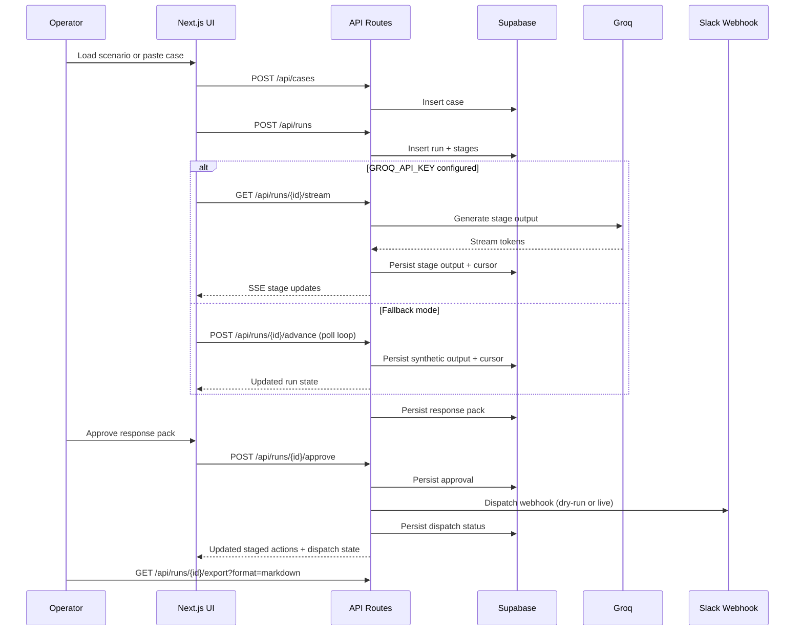

# Architecture — Async Copilot

> AI-powered customer support triage system. Real LLM inference (Llama 3.3 70B via Groq),
> server-owned state machine, SSE streaming, and production-grade observability.

## System Overview

```
┌─────────────┐        ┌──────────────────────┐        ┌──────────────┐
│   Browser    │◄──SSE──│  Next.js 15 (App)     │◄──SQL──│  Supabase    │
│  React 19    │        │  API Routes + Cron    │        │  Postgres    │
│  Tailwind    │        │  Vercel Serverless    │        │  RLS         │
└─────────────┘        └──────┬───────────────┘        └──────────────┘
                              │
                       ┌──────▼──────┐
                       │   Groq API   │
                       │ Llama 3.3   │
                       │  70B (free)  │
                        └─────────────┘
```

## Reviewer Flow In One Pass

This is the shortest accurate way to understand the system:

1. Operator creates a case from a seeded scenario or pasted ticket.
2. The server creates a run and advances a 6-stage workflow.
3. The UI receives either streamed LLM output or polling-based fallback output.
4. The server persists a response pack with recommendation, citations, and staged actions.
5. A human approval step is required before the Slack integration boundary is crossed.
6. Slack dispatch can run in `dry_run` or live mode, and its status is written back to the response pack.
7. The pack remains exportable as markdown/text/json for handoff.

## Sequence Diagram



## Directory Structure

```
src/
├── app/
│   ├── (app)/              # Workspace shell (no auth in current MVP)
│   │   └── app/            # Workspace: runs, samples, intake
│   ├── (marketing)/        # Landing + legal pages
│   └── api/
│       ├── cases/          # CRUD for support cases
│       ├── runs/           # Run lifecycle (create, advance, stream, export)
│       │   └── [runId]/
│       │       ├── advance/    # POST — step the state machine
│       │       ├── stream/     # GET  — SSE real-time LLM tokens
│       │       ├── approve/    # POST — human approval
│       │       └── export/     # GET  — export run data
│       ├── samples/        # Pre-built demo scenarios
│       ├── health/         # Uptime check
│       └── cron/
│           ├── cleanup-stale/  # Hourly: kill zombie runs
│           └── daily-stats/    # Daily: snapshot metrics
├── lib/
│   ├── ai/
│   │   ├── client.ts       # Groq provider (Vercel AI SDK)
│   │   └── prompts.ts      # 6 stage-specific system prompts
│   ├── supabase/
│   │   ├── admin.ts        # Service-role client (bypasses RLS)
│   │   └── types.ts        # Auto-generated DB types
│   ├── triage/
│   │   └── run-model.ts    # State machine logic + synthetic fallback
│   ├── integrations/
│   │   └── slack.ts        # Approval-gated Slack webhook dispatch
│   └── rate-limit.ts       # In-memory rate limiter (20 req/min/IP)
tests/
├── unit/                   # Vitest unit tests for run model + route behavior
└── golden-path.spec.ts     # Playwright E2E
supabase/
├── migrations/             # Postgres schema (001-004)
└── seeds/                  # Demo data + golden run
```

## Key Design Decisions

### 1. Server-Owned State Machine

Runs progress through 6 stages via a **server-side state machine**. The client never
advances the state — it calls `POST /advance` or connects to `GET /stream`, and the
server controls all transitions. This prevents race conditions and ensures consistent state.

**States:** `pending` → `running` → `completed` | `escalated` | `failed`

### 2. AI with Graceful Degradation

```
GROQ_API_KEY set?
  ├── Yes → Real LLM (Llama 3.3 70B via Groq, ~200ms per stage)
  │         ├── Success → Parse JSON output
  │         └── Failure → Fall back to synthetic
  └── No  → Synthetic (regex-based, instant, deterministic)
```

The system works identically with or without an API key. This means:
- **Demo environments** work instantly with no external dependencies
- **Production** gets real AI inference with automatic fallback

### 3. SSE Streaming

When AI is enabled, the client connects via **Server-Sent Events** to `/api/runs/[id]/stream`.
Tokens arrive character-by-character, similar to ChatGPT. The UI shows a dark terminal
panel with the blinking cursor and an "Llama 3.3 · Live" badge.

When AI is unavailable, the client automatically falls back to polling `/advance`.

### 4. Human Approval Boundary

`POST /api/runs/[id]/approve` is the only place where outbound integration can happen.

- Human approval is always required first.
- Slack dispatch defaults to `dry_run` unless a real webhook is configured.
- Non-Slack staged actions remain queued; the system does not autonomously execute refunds, emails, or ticket mutations.

This keeps the implementation honest while still proving a real external boundary.

### 5. Rate Limiting

In-memory sliding-window rate limiter (20 requests/minute/IP) on write endpoints.
Zero external dependencies. Can be swapped for `@upstash/ratelimit` for distributed limiting.

### 6. Self-Healing Cron

**Hourly:** `cleanup-stale` finds runs stuck in "running" for >30 minutes and marks them "failed".
**Daily:** `daily-stats` snapshots platform metrics into `daily_stats` table.

Both are secured via `CRON_SECRET` header (set automatically by Vercel).

## Data Model

| Table          | Purpose                                          |
|----------------|--------------------------------------------------|
| `samples`      | Pre-built demo scenarios with seeded outputs     |
| `cases`        | Support tickets (from intake or sample)          |
| `runs`         | Triage execution instances                       |
| `run_stages`   | Per-stage state, output, timing                  |
| `response_packs`| Final AI-generated response, citations, actions |
| `daily_stats`  | Platform metrics (populated by cron)             |

## Tech Stack

| Layer         | Technology                            | Cost   |
|---------------|---------------------------------------|--------|
| Framework     | Next.js 15, React 19, TypeScript 5    | Free   |
| Styling       | Tailwind CSS 3                        | Free   |
| Database      | Supabase Postgres + RLS               | Free   |
| AI Inference  | Groq (Llama 3.3 70B)                 | Free   |
| AI SDK        | Vercel AI SDK 6                       | Free   |
| Observability | Sentry (5k events/mo)                 | Free   |
| Hosting       | Vercel (Hobby)                        | Free   |
| CI/CD         | GitHub Actions                        | Free   |
| Unit Tests    | Vitest                                | Free   |
| E2E Tests     | Playwright                            | Free   |

**Total monthly cost: $0**

## Running Locally

```bash
cp .env.example .env.local
# Fill in Supabase + Groq keys
npm install
npm run db:init      # Run migrations + seed
npm run dev          # http://localhost:3000
npm test             # Vitest unit tests
npm run test:e2e     # Playwright E2E
```
