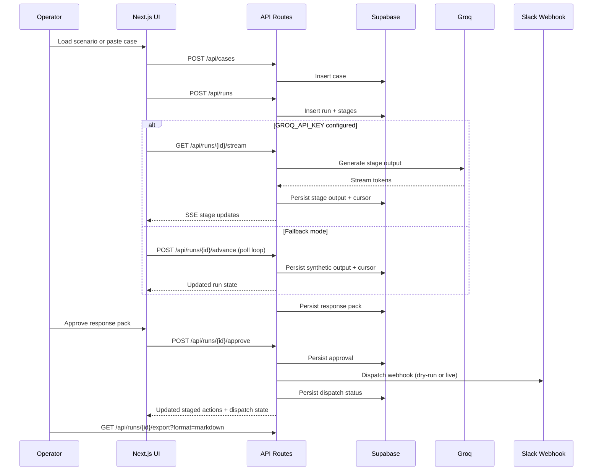
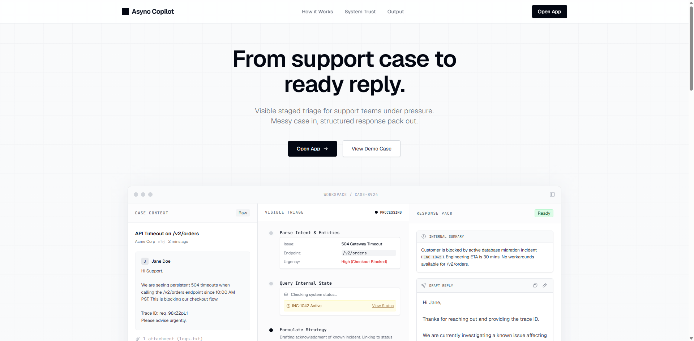
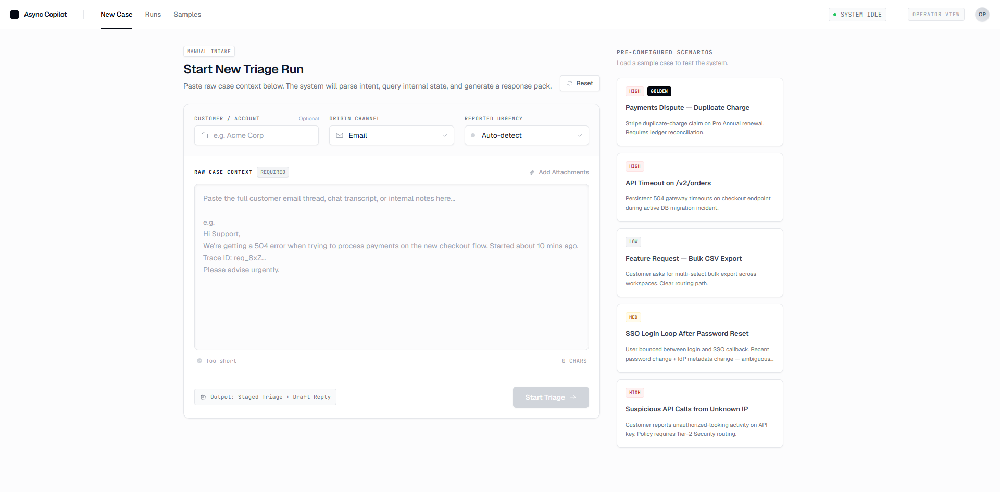
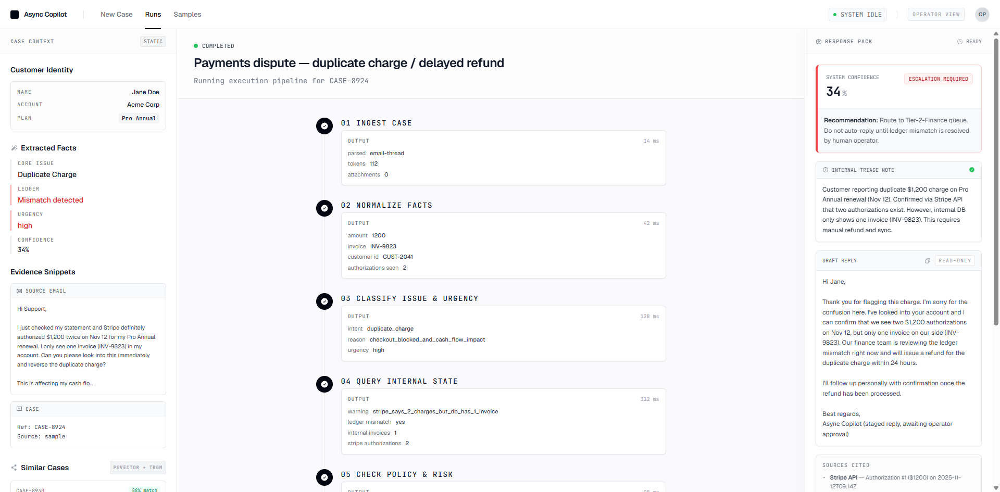
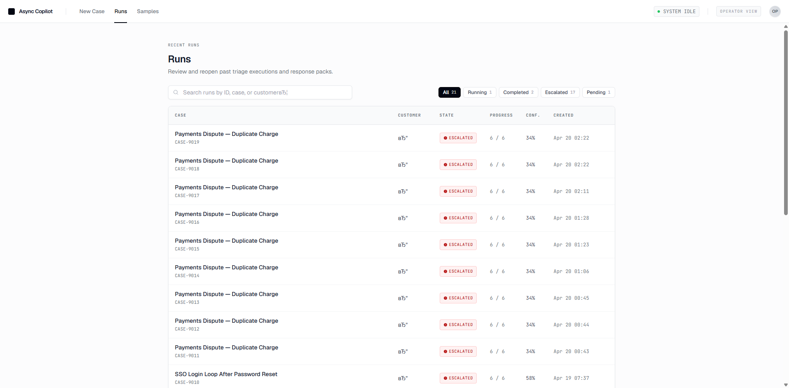

# Async Copilot

**Visible staged triage for support teams under pressure. Messy case in, structured response pack out.**

Live demo: **https://async-copilot.vercel.app**


A hiring-focused AI Product Engineer case study: a scoped support-triage workflow with real LLM inference, deterministic fallback, human approval gates, Slack dispatch evidence, and portable reviewer exports.

## Why this project exists

Async Copilot is not a generic chatbot demo. It shows how AI can sit inside a real operational workflow where a human operator still owns the final decision.

The product proves a narrow but complete loop:

- **Workflow product thinking:** intake -> visible triage -> response pack -> approval -> export.
- **Applied AI integration:** Groq/Llama inference when configured, synthetic fallback when not.
- **Trust boundaries:** no autonomous outbound action; Slack dispatch is approval-gated and logged.
- **Durability:** persisted run stages, event timeline, background pickup, retries, and idempotent action attempts.
- **Reviewer evidence:** markdown/text/JSON exports include provenance, approval history, action log, timing/fallback summaries, and golden assertions.
- **Delivery discipline:** unit tests, E2E smoke coverage, CI, audit tooling, and documented scope boundaries.

---

## Reviewer Quick Read

If you only spend 60-90 seconds on this repo, this is the flow to understand:

1. An operator starts with a pasted support case or a seeded scenario.
2. The system creates a case, creates a run, and advances a visible 6-stage triage workflow.
3. If `GROQ_API_KEY` is present, the run streams live stage output via SSE.
4. If AI is unavailable, the same workflow falls back to deterministic synthetic output.
5. The run ends with a response pack containing confidence, recommendation, citations, and staged actions.
6. A human must approve the pack before any outbound integration boundary is crossed.
7. Approval can trigger a Slack webhook in `dry_run` or live mode, while all other staged actions remain queued.
8. The full pack can be exported as markdown for handoff or review, including compact trust evidence.

## Operator Use Case

This demo is designed around a support-operations reviewer, not a generic AI playground.

- **Input:** an urgent or ambiguous support ticket
- **Middle:** visible classification, internal lookup, policy check, and draft generation
- **Output:** a response pack an operator can approve, export, or escalate
- **Boundary:** the system can prove one real external action after approval without pretending to be autonomous

## End-to-End Flow



## Proof Map

What is proven in code, not just described:

- **Golden-path E2E:** intake -> run -> escalation/completion -> approve -> export
- **Failure-path unit tests:** export before pack ready, stream without AI, approval dispatch state
- **Build hygiene:** lint, unit tests, production build, typecheck, and high-severity production dependency audit in CI
- **Honest fallback:** the app remains usable without a model key

## Hiring Signal

This repository is structured as a flagship portfolio project for an **AI Product Engineer / Applied AI Engineer** profile.

- **Product judgment:** scoped a narrow support-ops workflow instead of a broad chatbot.
- **Full-stack execution:** shipped UI, API routes, database schema, auth/workspaces, and deployment wiring.
- **AI workflow engineering:** integrated streaming LLM output while keeping deterministic fallback behavior.
- **Trust and evaluation:** added provenance, approval history, action attempts, golden assertions, and portable exports.
- **Professional delivery:** kept validation gates, GitHub Actions, audit docs, demo assets, and scope boundaries aligned.

## Trust Evidence Snapshot

The trust/evidence layer stays intentionally narrow, but it now proves reviewer-facing signals without overstating autonomy:

- **Approval history:** every response-pack approval is persisted with actor/time and remains portable in reviewer exports.
- **Slack approval boundary:** Slack is still the only real outbound action boundary, and it remains approval-gated in staged actions plus action-attempt history.
- **Prompt/version provenance:** newly completed stages persist prompt/version runtime provenance for reviewer inspection.
- **Response-pack lineage:** exports summarize when the pack was created and how much of the run executed via AI versus synthetic fallback.
- **Compact timing/fallback evidence:** reviewer exports include concise timing, fallback, and parse-warning summaries instead of only raw stage blobs.
- **Golden regression checks:** exports lock stage template, duration template, confidence, timing, approval-gate, and urgency metadata alignment checks for the seeded golden path.
- **Honest wording:** reviewer-facing evidence is phrased to match what the code actually proves, including metadata alignment versus stronger runtime claims.

---

## Demo Walkthrough

The fastest visual way to evaluate this project is the bundled demo preview plus the short operator walkthrough.

- Demo preview: `public/demo/demo.gif`
- Demo asset package: `docs/demo/2026-04-25-async-copilot-demo-asset-package.md`
- Recording script: `docs/demo/2026-04-20-async-copilot-reviewer-walkthrough.md`
- Target length: **60-90 seconds**
- Core sequence: **intake -> run -> terminal pack -> approval -> Slack status -> export**

The GIF is the primary quick-look asset. The walkthrough remains the source of truth for re-recording a narrated 60-90 second demo.

### Screenshot Gallery

#### Landing



#### Intake Workspace



#### Completed Run / Response Pack



#### Runs List



---

## Try it

1. Open the landing — https://async-copilot.vercel.app
2. Click **Open App** → sign in with a magic link
3. If this is your first session, create a workspace in onboarding
4. Open the **Payments Dispute — Duplicate Charge** scenario card (golden path)
5. Hit **Start Triage** → watch the 6-stage timeline progress in real time
6. When it reaches terminal state (~5 sec), inspect the Response Pack, approve it, review the Slack dispatch status, or export the markdown pack
7. Navigate to **Runs** or **Samples** in the header to browse

Try **Paste** instead: type or paste your own case body in the textarea → it still creates a real case + run with a generic fallback response pack.

---

## Surfaces

| Route | Purpose |
|---|---|
| `/` | Marketing landing — 7 sections (header, hero + workspace mockup, how-it-works, system trust, response pack showcase, closing CTA, footer) |
| `/login` | Magic-link auth entry point |
| `/app` | Authenticated bootstrap redirect into onboarding or default workspace |
| `/app/onboarding` | First-workspace bootstrap flow |
| `/app/w/[workspaceSlug]` | **New Case** intake form + live sample picker inside a workspace |
| `/app/w/[workspaceSlug]/runs/[runId]` | **Live Triage Run** signature screen: Case Context / Visible Triage / Response Pack / Event Timeline |
| `/app/w/[workspaceSlug]/runs` | Workspace runs list with search, state chip filters, progress + confidence columns |
| `/app/w/[workspaceSlug]/samples` | Scenario library — Golden Path + Alternatives, with body preview |
| `/api/health` | Machine-readable env + schema + row-count snapshot |
| `/api/samples` · `/api/cases` · `/api/runs` · `/api/runs/[id]` | REST endpoints |
| `/api/runs/[id]/advance` · `/approve` · `/export` | Run lifecycle mutations + export |
| `/api/runs/[id]/stream` | **SSE streaming** — real-time LLM tokens (Llama 3.3 70B) |
| `/api/cron/process-runs` · `/cleanup-stale` · `/daily-stats` | Background pickup and maintenance cron jobs |

---

## Stack

- **Framework**: Next.js 15 (App Router, TypeScript, typedRoutes, `next/font/google`)
- **AI Inference**: Groq (Llama 3.3 70B) via Vercel AI SDK 6 — real streaming, JSON output
- **Styling**: Tailwind CSS 3.4 with project design tokens
- **Icons**: `@phosphor-icons/react` (server-side rendered SVG)
- **Database**: Supabase Postgres 17 (`eu-west-1` / Ireland)
- **Auth**: Supabase Auth (magic link), `@supabase/ssr` (browser + server), `@supabase/supabase-js` (admin)
- **Observability**: Sentry (error tracking, 5k events/mo free tier)
- **Hosting**: Vercel (Stockholm edge, auto-deploy on every push to `main`)
- **Unit Tests**: Vitest · **E2E**: Playwright
- **CI/CD**: GitHub Actions (audit + lint + unit tests + build + typecheck on pushes/PRs)
- **Rate Limiting**: In-memory sliding window (20 req/min/IP)
- **Cron**: Vercel Cron (background run pickup, stale-run cleanup, daily stats snapshot)

**Total monthly cost: $0** (all services on free tiers)

---

## Honest scope boundaries

- Gmail now exists only as a narrow manual import path: one workspace inbox, one thread/message import at a time.
- No workspace member management UI yet.
- No mailbox sync engine, Gmail history/webhook sync, or attachment ingestion yet.
- No CRM or ticketing integrations yet; the only outbound boundary is an optional Slack webhook dispatched after human approval.
- No production SLA claims or security guarantees beyond what is documented here.
- This is a portfolio implementation, not a live support product.

---

## Data model

The repo now combines the original run engine tables with the Milestone 3 workspace/auth foundation, the Milestone 4 Gmail/background execution layer, and a narrow Milestone 5 trust-history layer.

Operational core:

- `samples` — curated scenario library (read-only in UI)
- `cases` — support-case instances from manual intake, samples, or Gmail
- `runs` — triage lifecycle (`pending` → `running` → `completed`/`escalated`)
- `run_stages` — 6 stages per run with `output` JSON blobs, persisted timestamps, and legacy `duration_ms` seed metadata
- `response_packs` — final artifact (confidence, recommendation, summary, draft reply, citations, staged actions)
- `run_events` — append-only reviewer timeline and audit trail for material state transitions; new `stage.completed` rows now also carry per-stage prompt/version provenance
- `run_action_attempts` — durable outbound action attempt log for Slack delivery and retries
- `response_pack_approvals` — durable approval-history rows for the reviewer boundary

Workspace/auth layer:

- `profiles`
- `workspaces`
- `workspace_memberships`

Gmail source layer:

- `workspace_gmail_accounts` — one shared Gmail connection per workspace
- `gmail_messages` — durable imported Gmail source-of-truth rows

Schema: `supabase/migrations/001_initial_schema.sql` through `011_milestone5_approval_history.sql`
Seeds: `supabase/seeds/001_samples.sql` + `002_golden_run.sql`

Stage provenance note:
- prompt/version provenance is attached only to newly completed `stage.completed` events
- historical runs keep rendering normally, but older stage cards will not show provenance unless they were completed after this slice shipped

---

## Run locally

```bash
# 1. Install
npm install

# 2. Fill .env.local (copy .env.example)
cp .env.example .env.local
#    Required: NEXT_PUBLIC_SUPABASE_URL, NEXT_PUBLIC_SUPABASE_PUBLISHABLE_KEY,
#              SUPABASE_SECRET_KEY, SUPABASE_DB_URL
#    Optional: GROQ_API_KEY (enables real AI), NEXT_PUBLIC_SENTRY_DSN,
#              SLACK_WEBHOOK_URL, SLACK_WEBHOOK_DRY_RUN,
#              GOOGLE_CLIENT_ID, GOOGLE_CLIENT_SECRET, GOOGLE_OAUTH_REDIRECT_URI

# 3. One-shot migrate + seed
npm run db:init

# 4. Start dev
npm run dev
# → http://localhost:3000

# 5. Run tests
npm test             # Vitest unit tests
npm run test:e2e     # Playwright E2E
```

### Supabase Auth URL configuration

Magic-link auth requires the Supabase project to allow the production callback URL.

- **Site URL**: `https://async-copilot.vercel.app`
- **Redirect URLs**:
  - `https://async-copilot.vercel.app/auth/callback`
  - `https://async-copilot.vercel.app/**`
  - `http://localhost:3000/auth/callback`
  - `http://localhost:3000/**`

If the project still has `http://localhost:3000` as the Site URL, Supabase will ignore the requested production redirect and email links will send users back to localhost.

Useful scripts:

- `npm run typecheck` — strict TypeScript
- `npm run build` — production build
- `npm run lint`
- `npm test` — Vitest unit tests
- `npm run test:watch` — Vitest in watch mode
- `npm run db:migrate` · `npm run db:seed` — split init

### Google OAuth callback configuration

Manual Gmail import requires a Google OAuth client that allows the app callback URL.

- Development callback: `http://localhost:3000/api/gmail/callback`
- Production callback: `https://async-copilot.vercel.app/api/gmail/callback`

If `GOOGLE_OAUTH_REDIRECT_URI` is set, it must match one of the allowed redirect URIs in the Google Cloud OAuth client exactly.

---

## Key design decisions

- **Server-owned run progression** — every `/advance` call is authoritative on the server. Client never mutates state directly.
- **SSE streaming with polling fallback** — When `GROQ_API_KEY` is set, the client connects via SSE and streams real LLM tokens. Without it, falls back to `800ms` polling with synthetic (regex) output. Zero-config degradation.
- **Real AI, graceful fallback** — Llama 3.3 70B via Groq generates structured JSON for each stage. If the LLM fails or key is missing, regex-based inference kicks in seamlessly.
- **Rate limiting** — In-memory sliding window (20 req/min/IP) on write endpoints. Upgradeable to Upstash Redis.
- **Background pickup and cleanup** — Vercel Cron picks up queued/retrying runs and cleans up stale running runs.
- **Approval-gated integration boundary** — no autonomous action. Human approval can dispatch a Slack summary (live or dry-run); all other staged actions remain queued.
- **Narrow real Gmail intake** — a workspace can connect one Gmail inbox and manually import one thread/message into a case and run. Full sync/history processing remains deferred.
- **Idempotent schema + seeds** — `npm run db:init` is safe to re-run. Demo environment can be reset cheaply.
- **One source of design truth** — `docs/design/design-system.md` holds all tokens; every screen pulls from there.

---

## Repository map

```
src/
  app/
    layout.tsx, icon.svg, error.tsx, not-found.tsx
    (marketing)/
      page.tsx                         # landing page
    (app)/
      layout.tsx                       # authenticated app shell
      app/
        onboarding/page.tsx            # first-workspace bootstrap
        w/[workspaceSlug]/
          page.tsx                     # case intake + sample picker
          runs/page.tsx                # workspace run history
          runs/[runId]/page.tsx        # live run detail
          samples/page.tsx             # scenario library
    api/
      cases/route.ts                   # GET list, POST create
      cases/[caseId]/similar/route.ts  # pgvector similarity lookup
      gmail/callback/route.ts          # Google OAuth callback
      samples/route.ts                 # GET list
      runs/route.ts                    # GET list, POST create
      runs/[runId]/route.ts            # GET detail
      runs/[runId]/advance/route.ts    # POST — one stage forward
      runs/[runId]/approve/route.ts    # POST — approve response pack
      runs/[runId]/export/route.ts     # GET — markdown/text/json
      runs/[runId]/stream/route.ts     # GET — SSE stage streaming
      workspaces/route.ts              # workspace bootstrap
      cron/process-runs/route.ts       # background run pickup
      health/route.ts                  # GET — env + schema + counts
  components/
    marketing/hero-mockup.tsx
    shared/app-header.tsx
  features/
    intake/components/new-case-page.tsx
    runs/components/live-run-view.tsx
    runs/components/runs-table.tsx
  lib/
    ai/client.ts                         # Groq provider (Vercel AI SDK)
    integrations/slack.ts                # approval-gated Slack webhook helper
    integrations/gmail.ts                # narrow manual Gmail import helper
    ai/prompts.ts                        # 6 stage system prompts
    supabase/{client,server,admin,types}.ts
    runs/{background,create-run,events,execute-step}.ts
    triage/run-model.ts                  # state machine + synthetic fallback
    rate-limit.ts                        # in-memory rate limiter
supabase/
  migrations/001-011                     # Postgres schema through Milestone 5
  seeds/{001_samples,002_golden_run}.sql
scripts/
  db-init.mjs                            # pg-based migrator (no Supabase CLI)
tests/
  unit/*.test.ts                         # route + model unit coverage
  golden-path.spec.ts                    # Playwright E2E
docs/
  audit/                                # audit reports and scorecards
  brainstorms/                          # requirements and v2 product spec
  case-study/                           # reviewer-facing engineering narrative
  demo/                                 # GIF/screenshots/walkthrough package
  design/                               # design system and reference screenshots
```

---

## Deployment

- Every push to `main` → Vercel build → production deploy (~45 sec).
- Env vars are stored in Vercel encrypted storage (Development / Preview / Production).
- Supabase URL/keys are pulled at runtime via `process.env.*`.

---

## Audit tooling

Five tools are wired up for continuous quality checks. All are **opt-in**
— they do not run on every PR by default (kept advisory to avoid merge
friction). Run locally or via GitHub Actions `workflow_dispatch`.

| Script | What it does |
|---|---|
| `npm run audit:links` | **linkinator** — scans the live site for broken links, `href="#"` dead anchors, 404s. |
| `npm run audit:a11y` | **pa11y-ci + axe-core** — WCAG 2 AA scan across public routes. |
| `npm run audit:perf` | **Lighthouse CI** — perf / a11y / SEO / best-practices with enforced budgets (`lighthouserc.cjs`). |
| `npm run audit:visual` | **Lost Pixel** — screenshots 4 routes × 3 breakpoints, diffs against `.lostpixel/baseline/`. |
| `npm run audit` | Chains links → a11y → perf → visual. Full non-AI pass. |

GitHub Actions:

- `.github/workflows/audit-lighthouse.yml` — weekly Monday cron + manual trigger
- `.github/workflows/audit-a11y.yml` — weekly Monday cron + manual trigger
- `.github/workflows/audit-linkcheck.yml` — **lychee** on push to `main` + weekly cron
- `.github/workflows/audit-visual.yml` — manual trigger only (baselines are committed)

Each workflow uploads its output as an artifact (14-day retention) so
reports stay accessible without polluting the repo.

### Running a full audit locally

```bash
npm run audit         # links + a11y + perf + visual
```

Artifacts are written to `.lighthouseci/`, `.lostpixel/`, and workflow artifacts. Baselines for Lost Pixel should be committed only after an intentional visual change is approved.

### Last audit report

See `docs/audit/2026-04-26-github-hiring-readiness.md` for the current GitHub/repository hygiene pass and `docs/audit/2026-04-18.md` for the original site-audit baseline.

---

## Documents for reviewers

- `docs/case-study/engineering-case-study.md` — concise engineering narrative
- `docs/demo/2026-04-25-async-copilot-demo-asset-package.md` — GIF, screenshots, and walkthrough map
- `docs/audit/2026-04-26-github-hiring-readiness.md` — repo hygiene and security audit
- `ARCHITECTURE.md` — system architecture, data model, design decisions
- `docs/brainstorms/2026-04-24-async-copilot-v2-spec.md` — v2 product spec, chosen scenario, and milestone order
- `docs/brainstorms/2026-04-18-async-copilot-requirements.md` — 22 MVP requirements (R1–R22)
- `docs/design/design-system.md` — canonical tokens
- `docs/plans/2026-04-18-001-feat-async-copilot-demo-plan.md` — original 9-unit build plan
