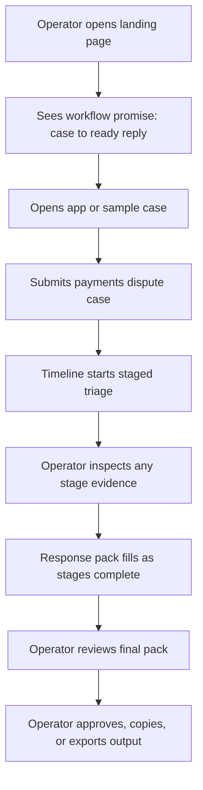

# Async Copilot Requirements

## Problem Frame
Async Copilot is a portfolio-quality support triage product concept for operators working under time pressure. The product takes a messy inbound support case, runs a visible staged triage flow, and produces a usable response pack the operator can inspect, approve, and use immediately.

The product must feel credible to support and operations specialists while also reading as a high-taste portfolio artifact for hiring managers and product-minded reviewers. Its differentiation is not generic AI capability. Its differentiation is a narrow, legible workflow: support case in, staged triage visible in the center, practical response pack out.

## User Flow

## Requirements

**Workflow and MVP Boundary**
- R1. The MVP must center on one polished golden flow: landing page, case intake, live triage run, completed response pack, and one or two curated sample cases.
- R2. The primary demo case must be a payments dispute scenario in which a customer reports a duplicate charge and a delayed refund.
- R3. The product must present the workflow as support operations software, not as a chatbot, generic AI dashboard, or ask-anything assistant.
- R4. The live run must show a fixed staged triage sequence: ingest case, normalize facts, classify issue and urgency, build triage assessment, and generate response pack.

**Trust and Operator Control**
- R5. The center timeline must be the primary interaction and trust surface of the app.
- R6. Each stage must expose inspectable evidence or extracted facts that explain why the system reached its current conclusion.
- R7. The trust model for MVP must be inspect then approve: the run proceeds automatically, the operator can open any stage to inspect evidence, and the operator acts at the end by approving, copying, or exporting the response pack.
- R8. The UI must communicate that the system is doing bounded triage work rather than open-ended conversation or autonomous action.
- R9. When evidence is incomplete or conflicting, the timeline must show low confidence, identify the missing or conflicting evidence, and recommend escalation rather than presenting the output as fully certain.

**Response Pack**
- R10. The response pack must be treated as the core output object, not a side feature.
- R11. The completed response pack must include a case summary, likely issue or hypothesis, customer-facing reply draft, internal note, recommended next actions, and escalation recommendation with confidence.
- R12. The response pack must feel immediately usable by a support or ops specialist without requiring them to reconstruct the case from scratch.
- R13. The operator must be able to approve, copy individual sections, or export the full response pack.

**Signature Screen**
- R14. The signature screen must be the live or just-completed triage run view composed as a left-to-right lockup: case facts and source snippets, center staged timeline, and response pack on the right.
- R15. The signature screen must make trust legible at a glance by visually linking stage progress, evidence, and response-pack output in one screen.
- R16. The visual language must feel premium, quiet, structured, and high-signal, without chat bubbles, avatars, or dashboard-card clutter.

**Landing Page Narrative**
- R17. The landing page hero must sell workflow value explicitly: messy support case in, visible triage in the middle, ready-to-use response pack out.
- R18. The landing page narrative must mirror the product workflow rather than present a generic AI feature list.
- R19. The landing page must emphasize practical operator value, visible trust, and handoff quality over model intelligence or automation claims.
- R20. The landing page must make the product thesis understandable within about 10 seconds of first view.

**Cuts and Non-goals**
- R21. The MVP must cut or strongly de-emphasize robust runs history, broad case management, queue management, collaboration, analytics dashboards, admin surfaces, training loops, deep integrations, and autonomous ticket handling.
- R22. Any secondary surfaces included for credibility, such as sample cases or light run history, must remain subordinate to the golden flow and must not compete with the center timeline.

## Success Criteria
- A first-time viewer can explain the product in one sentence: it turns a messy support case into a visible staged triage run and a ready-to-use response pack.
- The payments dispute demo feels believable for a real support specialist rather than like a generic AI demo.
- The live run screen is visually memorable because the timeline, evidence, and response pack read as one coherent triage system.
- The landing page sells workflow value and trust, not generic AI capability.
- The shipped artifact feels sharp because the MVP stays focused on one polished end-to-end story rather than a broad suite.

## Scope Boundaries
- No chat interface.
- No generic AI dashboard framing.
- No autonomous sending, closing, or routing of tickets.
- No deep third-party integrations required for MVP.
- No multi-user collaboration, permissions, or admin systems.
- No analytics homepage or queue-management suite.
- No attempt to support many case types equally well in the first polished artifact.

## Key Decisions
- One golden flow over a broader suite: this keeps the concept sharp and makes the portfolio artifact more memorable.
- Payments dispute as the anchor case: it provides clear evidence, urgency, and believable support output without drifting into incident-management software.
- Inspect then approve as the trust model: it gives operators control without interrupting the flow with heavy stage-by-stage approvals.
- Timeline plus evidence lockup as the signature screen: this is the clearest visual proof that the product is distinct from chat and dashboard patterns.
- From case to ready reply as the landing-page promise: this leads with practical workflow value instead of generic AI messaging.

## Dependencies / Assumptions
- The product can use curated or mocked case data as long as the scenario feels operationally believable.
- In low-confidence cases, the system should still produce a tentative response pack while clearly warning about evidence gaps and recommending escalation.
- The portfolio artifact is judged more on product clarity, workflow credibility, and execution quality than on breadth of operational coverage.
- One exemplary case flow is more valuable for this stage than partial support for many workflows.

## Outstanding Questions

### Resolve Before Planning
- None.

### Deferred to Planning
- [Affects R4-R9][Technical] How the staged progression and evidence reveal should be represented in the MVP so the run feels active and inspectable without implying unsupported back-end depth.
- [Affects R10-R13][Technical] Which export action or output format best balances practical value and scope for the portfolio artifact.
- [Affects R14-R20][Needs research] What content density and transition pacing best preserve credibility on the signature screen and landing page.

## Next Steps
-> /ce:plan for structured implementation planning
