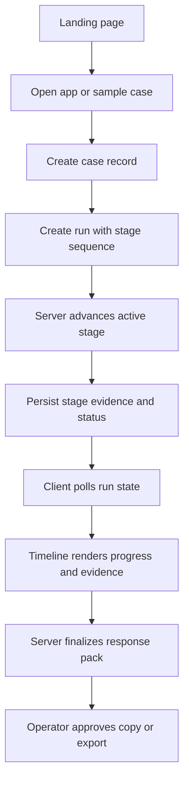
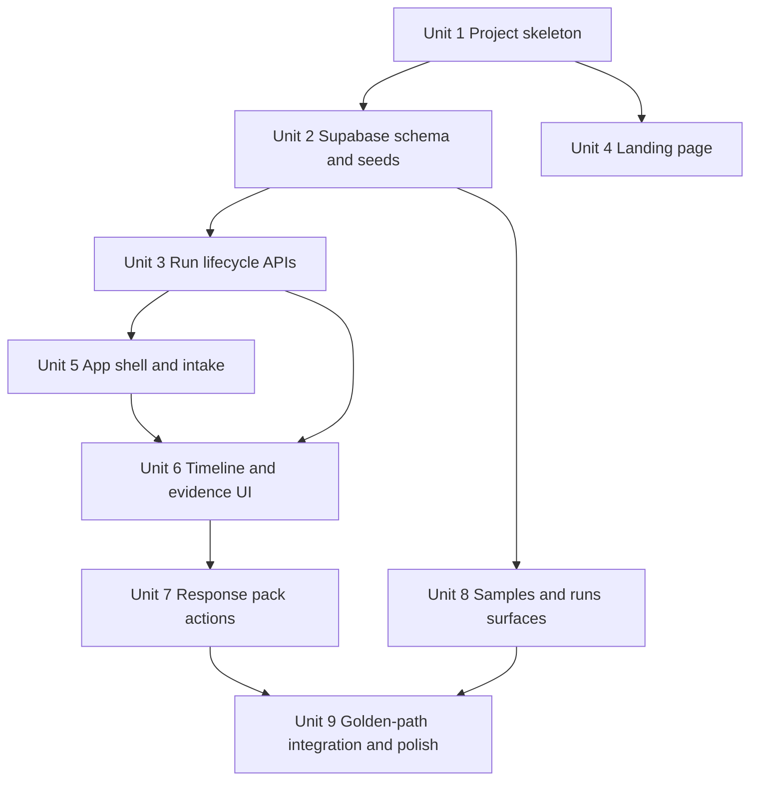
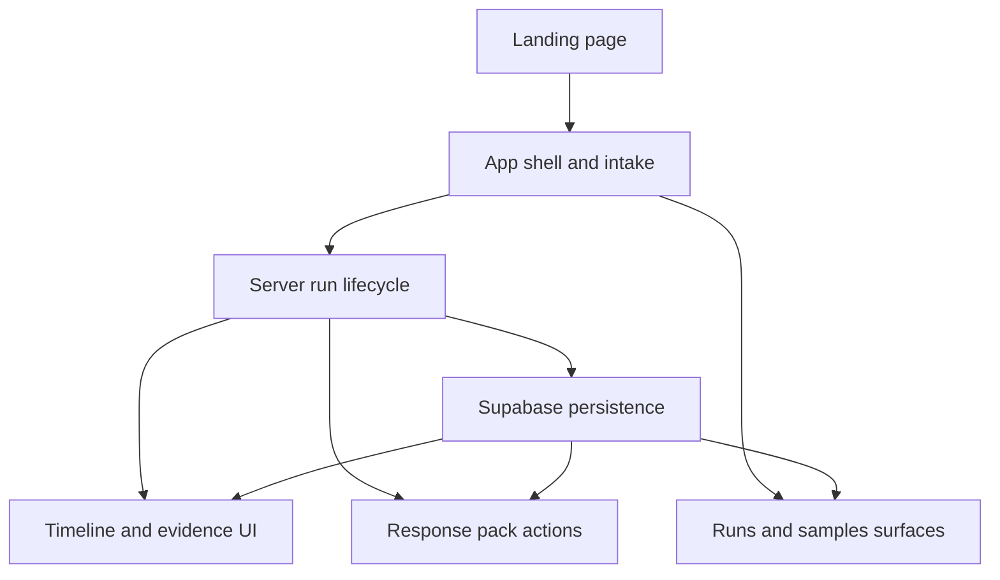

# feat: Build Async Copilot demo app

## Overview
Build a greenfield full-stack Async Copilot demo app in a single Next.js App Router codebase with a Supabase-backed data layer. The app should include a workflow-first landing page, a support-triage application surface, server-owned staged run progression, persisted runs, curated sample cases, and a usable response pack with copy/export actions.

The implementation should optimize for one polished payments-dispute golden flow while still establishing credible full-stack shape: database-backed runs, server-managed stage transitions, and replayable sample cases. The center timeline is the hero interaction and the main trust surface (see origin: `docs/brainstorms/2026-04-18-async-copilot-requirements.md`).

## Problem Frame
Async Copilot is intended to feel like premium support operations software rather than a chatbot or generic AI dashboard. The app must turn a messy support case into a visible staged triage run and a practical response pack that the operator can inspect, approve, and use immediately. The portfolio value depends on both product sharpness and implementation credibility, so this first plan assumes a real full-stack demo architecture rather than a frontend-only simulation (see origin: `docs/brainstorms/2026-04-18-async-copilot-requirements.md`).

## Requirements Trace
- R1-R4. Deliver one polished golden flow built around a fixed staged triage sequence and a payments-dispute sample case.
- R5-R9. Make the center timeline the trust surface, including inspectable evidence and explicit low-confidence escalation handling.
- R10-R13. Persist and render a practical response pack with approval, copy, and export actions.
- R14-R16. Make the live run screen the signature lockup and preserve a premium, high-signal visual language.
- R17-R20. Build a workflow-first landing page that sells case-to-reply value, not generic AI messaging.
- R21-R22. Keep all secondary surfaces subordinate to the golden flow; omit broad case management, collaboration, analytics, and autonomous ticket handling.

## Scope Boundaries
- No authentication or multi-user account system in the first implementation.
- No real ticketing integrations, email delivery, or autonomous outbound actions.
- No queue management, collaboration features, analytics dashboards, or admin surfaces.
- No generalized multi-domain support engine beyond the curated golden-flow case and a small sample library.
- No background-job infrastructure in the first pass; staged progression should remain server-owned but demo-friendly.

### Deferred to Separate Tasks
- Production auth, RBAC, and team workflows if the project later expands beyond portfolio/demo use.
- Real external support-system integrations and outbound delivery.
- Advanced monitoring, analytics, and operator queue tooling.

## Context & Research

### Relevant Code and Patterns
- The repository is currently greenfield for implementation work: only `docs/ideation/2026-04-17-async-copilot-ideation.md` and `docs/brainstorms/2026-04-18-async-copilot-requirements.md` exist.
- There are no existing app, API, schema, UI, or test patterns to preserve.
- There are no repo-local `AGENTS.md` or `CLAUDE.md` files at the repo root; only global guidance applies.

### Institutional Learnings
- No relevant `docs/solutions/` learnings exist yet in this repository.

### External References
- Planning assumption: use current Next.js App Router conventions for a single marketing + app codebase.
- Planning assumption: use Supabase as the first persistence layer because it supports a realistic hosted full-stack demo shape without requiring separate infra repos.
- These assumptions should be validated during implementation setup if framework/service defaults have shifted.

## Key Technical Decisions
- **Single Next.js App Router codebase**: keeps landing and app surfaces coherent while still supporting server-rendered pages, route handlers, and interactive client islands. This directly supports the origin requirement that the landing page and app tell one workflow story rather than feeling like separate products.
- **Supabase-backed persistence**: gives the demo believable data durability for runs, sample cases, stage evidence, and response packs without forcing bespoke backend infrastructure. The tradeoff is external-service dependency, but that is acceptable because the portfolio artifact benefits more from realistic persistence than from self-hosting purity.
- **Route handlers own run mutations; server-rendered routes own read composition**: create runs, advance stages, approve packs, and export artifacts through explicit API surfaces, while page loads compose persisted run state on the server. Polling should hit a dedicated advance/status endpoint pair rather than relying on GET reads that also mutate state. This keeps the run lifecycle inspectable and refresh-safe without overcommitting to server-action-heavy orchestration before the domain shape stabilizes.
- **Server routes mediate all persisted writes**: client components may request mutations, but the browser should not write directly to Supabase tables. This keeps demo data controls, service-role usage, and abuse protection centralized in server-owned boundaries.
- **Server components for data-backed page shells; client components for timeline interaction**: keep page-level loading and persisted reads on the server, but use client islands for polling, stage expansion, copy interactions, and approval/export affordances. This preserves the server-owned trust model while keeping the signature screen responsive.
- **Server-owned staged progression**: keeps trust semantics credible by making run state authoritative on the server rather than purely client-simulated. The plan deliberately avoids background-job infrastructure in the first pass; progression should advance through persisted server logic that can be polled safely.
- **Seeded sample cases plus manual case intake**: supports the polished golden demo while preserving the product promise that a support case can also be pasted in. This balances a controlled portfolio narrative with believable operator workflow.
- **Polling-based live updates for the first pass**: sufficient for demo-grade stage progression without introducing realtime complexity before the core workflow proves out. If polling later proves visually weak, that is a follow-on implementation concern rather than a blocker to the first release.
- **Low-confidence runs still produce tentative output**: preserves workflow continuity while making trust visible through warnings and escalation recommendations (see origin: `docs/brainstorms/2026-04-18-async-copilot-requirements.md`). The key decision is to avoid either false certainty or hard stops that would break the demo flow.
- **No authentication in the first release despite persisted data**: this is a deliberate scope tradeoff, not an omission. The app should be treated as a demo environment with non-sensitive seeded or synthetic data only, which keeps the MVP sharp while avoiding fake enterprise surfaces.

## Open Questions

### Resolved During Planning
- **Implementation target**: plan for a full-stack demo app rather than a frontend-only simulation.
- **Framework**: use Next.js App Router for both marketing and application surfaces.
- **Persistence choice**: use Supabase rather than local-only storage so the demo has credible persisted runs and sample data.

### Deferred to Implementation
- **Exact Supabase client helper layout**: the project will need server-safe and client-safe access patterns, but the final helper/module split can be chosen once the skeleton exists.
- **Export format details**: whether the first export is plain text, Markdown, or downloadable file can be chosen while implementing the response-pack actions.
- **Timeline pacing values**: the exact duration and cadence of stage transitions should be tuned during implementation once the UI exists.
- **Generated-content strategy**: whether response packs are seeded, templated, or derived from deterministic server logic can be finalized once the schema and run lifecycle are in place.
- **Public demo data guardrails**: the exact reset strategy, retention window, and cleanup behavior for persisted demo runs can be finalized once the deployment approach is chosen.
- **Polling cadence and termination rules**: the exact refresh interval, stop conditions, and stale-run handling can be finalized once the persisted progression loop is implemented and visually tested.

## Output Structure

    app/
      (marketing)/
        page.tsx
      (app)/
        app/
          page.tsx
          runs/
            [runId]/
              page.tsx
          samples/
            page.tsx
      api/
        cases/route.ts
        runs/route.ts
        runs/[runId]/route.ts
        runs/[runId]/advance/route.ts
        runs/[runId]/approve/route.ts
        runs/[runId]/export/route.ts
    components/
      marketing/
      app-shell/
      triage/
      response-pack/
      shared/
    lib/
      supabase/
      triage/
      samples/
      formatting/
    supabase/
      migrations/
      seed/
    tests/
      app/
      api/
      components/
      e2e/

## High-Level Technical Design

> *This illustrates the intended approach and is directional guidance for review, not implementation specification. The implementing agent should treat it as context, not code to reproduce.*

## Implementation Units

- [ ] **Unit 1: Scaffold the Next.js full-stack app**

**Goal:** Establish the application skeleton for a single-codebase marketing + app experience with shared styling, routing, and testing foundations.

**Requirements:** R1, R3, R14-R20

**Dependencies:** None

**Files:**
- Create: `package.json`
- Create: `next.config.ts`
- Create: `tsconfig.json`
- Create: `app/layout.tsx`
- Create: `app/(marketing)/page.tsx`
- Create: `app/(app)/app/page.tsx`
- Create: `components/shared/`
- Create: `components/marketing/`
- Create: `components/app-shell/`
- Create: `tests/app/smoke.test.ts`

**Approach:**
- Set up the App Router project so the marketing and in-app surfaces share a visual system but have distinct route groups.
- Reserve the root marketing route for the landing narrative and place the operator workflow under an explicit app route group.
- Establish the styling and component organization needed for a premium, high-signal product UI without introducing unnecessary abstraction layers.

**Patterns to follow:**
- No existing repo patterns; use conventional App Router route grouping and colocated shared UI modules.

**Test scenarios:**
- Happy path: visiting `/` renders the landing shell with workflow-first hero content.
- Happy path: visiting `/app` renders the application shell without requiring auth.
- Edge case: unknown routes render the framework default or project-defined not-found behavior without exposing broken placeholders.
- Integration: shared layout chrome and global styles apply consistently to both marketing and app routes.

**Verification:**
- A developer can start the app and navigate between marketing and app surfaces with a stable shell and no dead routes.

- [ ] **Unit 2: Model persisted runs, stages, and sample cases in Supabase**

**Goal:** Define the durable data model for support cases, run progression, stage evidence, and response-pack output.

**Requirements:** R1-R2, R4-R13, R21-R22

**Dependencies:** Unit 1

**Files:**
- Create: `supabase/migrations/`
- Create: `supabase/seed/`
- Create: `lib/supabase/`
- Create: `lib/samples/seed-samples.ts`
- Create: `lib/triage/run-model.ts`
- Create: `tests/api/supabase-schema.test.ts`

**Approach:**
- Define relational structures for cases, runs, stages, evidence items, and response packs so the server can own status transitions and the client can render a believable audit trail.
- Seed at least the payments-dispute golden case and one secondary sample so the product can demo immediately after setup.
- Keep the schema intentionally narrow around the portfolio flow; do not model queues, collaborators, or generalized domain expansion.

**Patterns to follow:**
- No existing repo patterns; use a minimal relational schema with explicit status fields and timestamps.

**Test scenarios:**
- Happy path: seeding creates the golden payments-dispute sample case and its related starter data.
- Happy path: a new run can persist linked case, stage, evidence, and response-pack records.
- Edge case: a run with incomplete or conflicting evidence can store low-confidence status and escalation recommendation without schema exceptions.
- Error path: invalid foreign-key relationships or missing required fields are rejected by the persistence layer.
- Integration: reading a persisted run returns enough joined data to render the timeline, evidence panel, and response pack without extra ad hoc shaping.

**Verification:**
- The project has a seedable data model that cleanly supports the end-to-end golden flow and low-confidence escalation state.

- [ ] **Unit 3: Implement server-owned case and run lifecycle endpoints**

**Goal:** Create the server flows that accept case input, create runs, advance stages, and persist final response packs.

**Requirements:** R1-R13, R21-R22

**Dependencies:** Unit 2

**Files:**
- Create: `app/api/cases/route.ts`
- Create: `app/api/runs/route.ts`
- Create: `app/api/runs/[runId]/route.ts`
- Create: `app/api/runs/[runId]/advance/route.ts`
- Create: `lib/triage/create-run.ts`
- Create: `lib/triage/advance-run.ts`
- Create: `lib/triage/build-response-pack.ts`
- Create: `lib/triage/evidence-engine.ts`
- Create: `tests/api/runs.test.ts`

**Approach:**
- Expose a narrow set of server endpoints for creating a case/run, fetching run state, and explicitly advancing progression until completion.
- Keep the stage engine deterministic and demo-friendly: progression should be owned by the server and persisted between requests, but it does not need real async job infrastructure in the first iteration.
- Model low-confidence handling explicitly so incomplete or conflicting evidence produces visible warnings and escalation recommendations instead of silent certainty.

**Execution note:** Start with failing API-level tests for run creation, stage progression, and low-confidence handling before wiring the implementation.

**Technical design:** *(directional guidance, not implementation specification)*
- Create run -> initialize ordered stage records -> each fetch/advance request moves the active stage when prior conditions are met -> final stage persists response pack -> completed run becomes read-only except approval/export actions.

**Patterns to follow:**
- No existing repo patterns; use one clear server-side lifecycle module per responsibility rather than premature generic engines.

**Test scenarios:**
- Happy path: submitting the payments-dispute case creates a run with the expected ordered stage sequence.
- Happy path: fetching an in-progress run returns stage statuses, evidence accumulated so far, and no final pack until generation completes.
- Happy path: the final progression step persists a response pack with summary, hypothesis, reply draft, internal note, next actions, confidence, and escalation recommendation.
- Edge case: low-confidence evidence produces a tentative pack and explicit escalation recommendation.
- Error path: fetching an unknown run id returns a not-found response.
- Error path: malformed case input is rejected with a validation failure instead of creating partial records.
- Integration: progression requests update persisted run state so refreshing the page continues from the saved stage rather than restarting client-side.

**Verification:**
- The backend can own the full lifecycle from case intake through completed response pack without relying on client-only state.

- [ ] **Unit 4: Build the workflow-first landing page**

**Goal:** Implement the marketing page that sells case-to-reply workflow value and reflects the product’s premium operational identity.

**Requirements:** R1, R3, R14-R20

**Dependencies:** Unit 1

**Files:**
- Modify: `app/(marketing)/page.tsx`
- Create: `components/marketing/hero.tsx`
- Create: `components/marketing/workflow-section.tsx`
- Create: `components/marketing/trust-section.tsx`
- Create: `components/marketing/output-section.tsx`
- Create: `tests/components/marketing-page.test.tsx`

**Approach:**
- Structure the page around the same three-step narrative as the product: support case in, visible staged triage, response pack out.
- Use product-specific proof surfaces, not generic SaaS grids, to communicate trust, workflow clarity, and response-pack payoff.
- Make the primary CTA route directly into the demo app or sample-case flow.

**Patterns to follow:**
- Mirror the requirements document’s hero promise and non-goals rather than inventing broader messaging.

**Test scenarios:**
- Happy path: the hero communicates case-to-ready-reply value without chatbot or generic AI dashboard language.
- Happy path: workflow sections mirror the three-step product story and link into the app.
- Edge case: the page remains understandable if product screenshots or animated elements are absent or degraded.
- Integration: clicking the primary CTA moves the user into the app experience without dead navigation.

**Verification:**
- A first-time viewer can infer the product thesis from the landing page alone within a few seconds.

- [ ] **Unit 5: Build the app shell and case intake surface**

**Goal:** Create the operator-facing shell that accepts pasted cases or sample-case selection and starts a run.

**Requirements:** R1-R4, R10-R13, R21-R22

**Dependencies:** Units 1, 2, and 3

**Files:**
- Modify: `app/(app)/app/page.tsx`
- Create: `components/app-shell/app-nav.tsx`
- Create: `components/triage/case-intake-form.tsx`
- Create: `components/triage/sample-case-picker.tsx`
- Create: `lib/triage/submit-case.ts`
- Create: `tests/components/case-intake.test.tsx`

**Approach:**
- Keep intake simple: paste a case or load a curated sample, then transition directly into the live run view.
- Preserve the product sharpness by treating all supporting navigation as subordinate to starting or revisiting the golden workflow.
- Structure the app shell so later runs and samples surfaces can reuse it without creating dashboard clutter.

**Patterns to follow:**
- Follow the origin document’s app information architecture: New Case, Runs, Samples.

**Test scenarios:**
- Happy path: pasting a valid case and starting triage creates a run and navigates to its live view.
- Happy path: selecting the seeded payments-dispute sample preloads or creates the intended golden-flow run.
- Edge case: empty input keeps the run from starting and surfaces actionable validation feedback.
- Error path: server-side intake failures preserve entered content and expose a recoverable error state.
- Integration: starting a run lands on a route that can be refreshed and still load persisted state from the server.

**Verification:**
- Operators can reliably start the triage workflow from either pasted input or curated samples without ambiguity.

- [ ] **Unit 6: Implement the signature timeline and evidence lockup**

**Goal:** Render the live/complete run view as the product’s signature screen with case facts on the left, timeline in the center, and response-pack progress on the right.

**Requirements:** R4-R9, R14-R16

**Dependencies:** Units 3 and 5

**Files:**
- Create: `app/(app)/app/runs/[runId]/page.tsx`
- Create: `components/triage/run-layout.tsx`
- Create: `components/triage/stage-timeline.tsx`
- Create: `components/triage/stage-card.tsx`
- Create: `components/triage/evidence-panel.tsx`
- Create: `components/triage/confidence-warning.tsx`
- Create: `tests/components/run-timeline.test.tsx`
- Create: `tests/e2e/golden-run.spec.ts`

**Approach:**
- Use server-fetched run state for the authoritative view and client-side polling or refresh triggers for live progression.
- Design the stage cards to communicate current status, evidence depth, and low-confidence escalation clearly without turning the UI into a chat transcript.
- Keep the left-center-right lockup stable across in-progress and completed states so the screen remains visually memorable.

**Execution note:** Implement against a persisted run fixture first so the live polling layer is added on top of a stable render target.

**Technical design:** *(directional guidance, not implementation specification)*
- Server route loads run aggregate -> client polls active runs against a dedicated advance/status flow while status is active -> timeline view re-renders ordered stages from persisted server state -> evidence drawer/card expansion reveals supporting facts -> low-confidence state inserts warning treatment and escalation messaging.

**Patterns to follow:**
- Follow the requirements document’s lockup and stage sequence exactly; do not improvise alternate layouts.

**Test scenarios:**
- Happy path: an in-progress run renders ordered stages and advances visually as server state changes.
- Happy path: expanding a stage reveals its associated evidence without losing the main timeline context.
- Edge case: a low-confidence stage renders warning treatment and escalation messaging while still preserving access to the tentative response pack.
- Edge case: a completed run renders the same layout with stable stage history rather than switching to a disconnected summary screen.
- Error path: a failed fetch or progression issue surfaces a recoverable run-state error instead of blanking the UI.
- Integration: refreshing the run page during progression resumes from persisted server state and not from a reset client timeline.

**Verification:**
- The live run view reads as the unmistakable hero experience of the product and remains trustworthy under normal and low-confidence states.

- [ ] **Unit 7: Implement response-pack approval, copy, and export actions**

**Goal:** Deliver the practical payoff object of the workflow: a usable response pack with clear operator actions.

**Requirements:** R7, R9-R13

**Dependencies:** Units 3 and 6

**Files:**
- Create: `components/response-pack/response-pack-panel.tsx`
- Create: `components/response-pack/response-pack-section.tsx`
- Create: `components/response-pack/response-pack-actions.tsx`
- Create: `app/api/runs/[runId]/approve/route.ts`
- Create: `app/api/runs/[runId]/export/route.ts`
- Create: `lib/formatting/export-response-pack.ts`
- Create: `tests/components/response-pack.test.tsx`
- Create: `tests/api/response-pack-actions.test.ts`

**Approach:**
- Treat the pack as a structured object with sections for summary, hypothesis, customer reply, internal note, next actions, and escalation/confidence.
- Make end-of-flow control explicit: the operator approves the pack, then copies sections or exports the full artifact.
- Keep export simple in the first pass while still producing a believable handoff artifact.

**Patterns to follow:**
- Preserve the inspect-then-approve trust model from the origin document.

**Test scenarios:**
- Happy path: a completed run renders all required response-pack sections with approval and copy actions.
- Happy path: approving the response pack marks the run as operator-approved without mutating the underlying generated content unexpectedly.
- Happy path: exporting produces a complete handoff artifact containing all required sections.
- Edge case: low-confidence runs include warning language and escalation guidance in the rendered/exported pack.
- Error path: approval or export failures surface recoverable UI feedback without losing the pack contents.
- Integration: copy/export actions operate on persisted server-owned pack data, not transient client-only values.

**Verification:**
- The workflow ends in a concrete artifact a support specialist could plausibly use immediately.

- [ ] **Unit 8: Add runs and samples supporting surfaces**

**Goal:** Add secondary navigation surfaces for revisiting seeded samples and completed runs without diluting the golden flow.

**Requirements:** R1, R2, R21-R22

**Dependencies:** Units 2, 3, and 5

**Files:**
- Create: `app/(app)/app/samples/page.tsx`
- Create: `app/(app)/app/runs/page.tsx`
- Create: `components/triage/sample-library.tsx`
- Create: `components/triage/runs-list.tsx`
- Create: `tests/components/runs-list.test.tsx`

**Approach:**
- Keep these surfaces intentionally light: enough to prove the app has durable runs and curated demos, but not enough to become a queue-management or analytics product.
- Use them as entry points back into the signature run experience rather than standalone productivity tools.

**Patterns to follow:**
- Follow the requirements document’s “subordinate to the golden flow” constraint.

**Test scenarios:**
- Happy path: the runs list displays previously created runs and links to their persisted detail pages.
- Happy path: the samples page exposes the payments-dispute case and at least one secondary example.
- Edge case: empty-state messaging remains subordinate and invites the user back into the main intake flow.
- Integration: selecting a prior run or sample navigates into the canonical run route with intact persisted data.

**Verification:**
- Secondary surfaces add credibility without competing visually or behaviorally with the center-timeline workflow.

- [ ] **Unit 9: Integrate the golden path and polish trust-critical details**

**Goal:** Connect all surfaces into one believable end-to-end portfolio artifact and tune the most important workflow, state, and visual transitions.

**Requirements:** R1-R22

**Dependencies:** Units 4 through 8

**Files:**
- Modify: `app/(marketing)/page.tsx`
- Modify: `app/(app)/app/page.tsx`
- Modify: `app/(app)/app/runs/[runId]/page.tsx`
- Modify: `components/triage/stage-timeline.tsx`
- Modify: `components/response-pack/response-pack-panel.tsx`
- Create: `tests/e2e/landing-to-run.spec.ts`
- Create: `tests/e2e/low-confidence-run.spec.ts`

**Approach:**
- Tune navigation, stage pacing, loading states, low-confidence treatment, and copy/export completion so the whole experience feels like one cohesive product.
- Use end-to-end scenarios to validate the exact promise made by the landing page and fulfilled by the app.
- Keep polish bounded to trust and workflow clarity; avoid expanding scope into extra features.

**Patterns to follow:**
- Let the origin document’s success criteria drive polish priorities, especially first-view clarity and trust legibility.

**Test scenarios:**
- Happy path: a user can move from landing page CTA to the payments-dispute run and complete the full workflow through approval/export.
- Happy path: the completed run screen remains visually consistent with the in-progress signature view.
- Edge case: the low-confidence path still completes the workflow with clear warnings and escalation recommendation.
- Error path: transient run-load failures or export issues do not break the overall golden flow beyond recoverable messaging.
- Integration: persisted runs remain accessible after refresh and from the runs list, preserving the same response-pack content.

**Verification:**
- The shipped artifact supports a polished end-to-end demo that clearly communicates and fulfills the Async Copilot product thesis.

## System-Wide Impact

- **Interaction graph:** landing page CTA, app intake, run lifecycle endpoints, Supabase persistence, timeline UI, and response-pack actions all participate in the same golden-flow narrative.
- **Error propagation:** intake, run fetch, progression, approval, and export failures should surface as recoverable UI states at the point of action without erasing persisted run context.
- **State lifecycle risks:** duplicate run creation, stale polling reads, partially completed stage updates, and mismatch between persisted pack state and rendered UI are the key lifecycle hazards.
- **API surface parity:** all user-visible state transitions must be readable through persisted run endpoints so refresh, deep-linking, and runs-list access stay consistent; mutation endpoints should remain explicit and separate from read endpoints.
- **Integration coverage:** end-to-end tests must prove landing-to-run handoff, persisted progression on refresh, and low-confidence escalation behavior; unit tests alone will not cover these seams.
- **Unchanged invariants:** this first plan does not introduce auth, collaboration, outbound delivery, or external support-system integrations.

## Risks & Dependencies

| Risk | Mitigation |
|------|------------|
| Supabase setup or environment friction slows initial execution | Keep the schema narrow, document required environment variables clearly, seed the golden-flow data immediately after setup, and isolate deployment-specific configuration from core domain work |
| Public demo data creates accidental trust or privacy issues | Treat all seeded and user-submitted content as demo-only, avoid sensitive real-world data in fixtures, document the public-demo posture in setup and deployment notes, and ensure server-side write paths can reject oversized or obviously unsafe submitted payloads |
| Public write endpoints invite spam or uncontrolled growth | Keep write access behind server-mediated validation, rate-limit or otherwise constrain public mutations at the hosting boundary, and document reset/cleanup expectations for demo deployments |
| Server-owned progression feels artificial or brittle | Use deterministic progression rules with persisted statuses, explicit active/completed/error states, and tune timing only after the underlying lifecycle works reliably |
| Polling introduces stale or jumpy timeline behavior | Limit polling to active runs, stop once terminal states are reached, and treat refresh-safe persistence as more important than theatrical animation smoothness |
| The UI drifts toward generic AI SaaS patterns | Treat the timeline lockup and response-pack workflow as non-negotiable constraints during implementation and review |
| Secondary surfaces bloat the MVP | Keep runs and samples read-only/lightweight and defer any queue-management behaviors |
| Export or approval actions become over-engineered | Start with one simple persisted approval state and one simple export artifact format |
| Lack of auth blurs the boundary between demo and real product behavior | Keep the app explicitly framed as a demo environment with no production integrations, no sensitive customer data, and no collaboration surfaces that imply real operational deployment |

## Documentation / Operational Notes
- Add a project setup section once implementation begins covering required Supabase environment variables, local seed workflow, and demo data reset expectations.
- If the project is deployed publicly, document that the app is a demo environment with seeded/generated support data only.
- Capture final demo steps in a later walkthrough or release note once the golden path is functional.

## Sources & References
- **Origin document:** `docs/brainstorms/2026-04-18-async-copilot-requirements.md`
- Related ideation: `docs/ideation/2026-04-17-async-copilot-ideation.md`
- Related code: none yet — greenfield implementation
